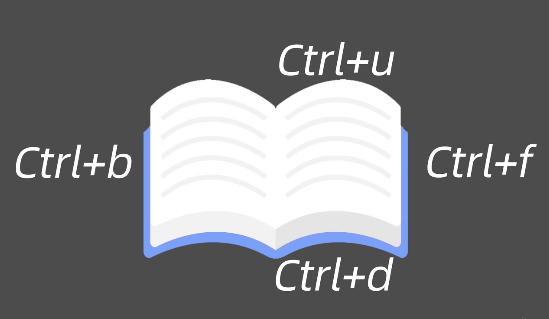

#### 三种模式
---
1.命令模式  
2.插入模式  
3.尾行模式  

>  输入:进入尾行模式  
> 输入a进入插入模式  
> 输入O在当前行的上一行插入

：x 保存推出
#### 常用的基本操作

HJKL 左下上右

^ 行首  
$ 行尾

yy 复制一行内容
p 粘贴到下一行
dd 删除一行

2yy 复制2行内容
3p 粘贴3次

:set number    nu
显示行号
:set nonumber

