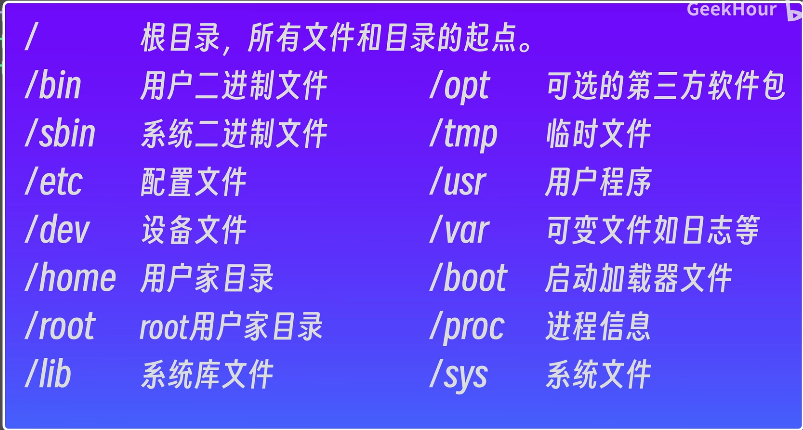

ls -l 详细

ls -a 包括隐藏文件

ls -ltr

ln -s 创建软连接

ln -s hello.txt link.txt
 
每个文件都有一个inode节点

硬链接 原文件和目标文件的i节点是一样的

删除源文件 硬连接的文件还是可以访问的

硬链接只能指向文件不能指向目录

chmod +x hello1.txt
添加可执行权限
 变成绿色

 chmod +rw  读写

 chomd -x
 chmod -rw
 

 linux rm 不可恢复